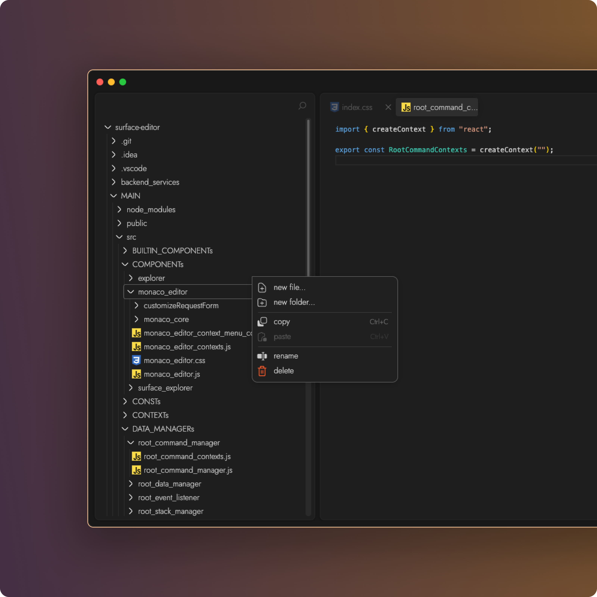

#  Surface Editor

## "Not replacing developers, but helping developers."

`Surface Editor` is a code editor built by developers for developers—not an auto-coding tool that churns out Flappy Bird clones. It’s a tool designed specifically to enhance coding efficiency by combining the power of AI with a revolutionary new UI, introducing a whole new way to code.

## [ Table of Contents ]

- ABOUT THE PROJECT
  - [Built With](#built-with)
  - [Contributors](#contributors)
- TO EVERYONE
- TO DEVELOPERS
  - [UI Prototype](#ui-prototype)
  - [Required Installation](#required-installation)
  - [Recommended Installation for further development](#recommended-installation)
  - [Local Setup](#local-setup)
  - [Join the development team](#)

## [ About the Project ]

### BUILT WITH

[![OpenAI][OpenAI-shield]][OpenAI-url]
[![React][React-shield]][React-url]
[![Express][Express-shield]][Express-url]
![Prettier][Prettier-shield]
[![CodeMirror][CodeMirror-shield]][CoderMirror-url]
[![MonacoEditor][MonacoEditor-shield]][MonacoEditor-url]
[![Electron][Electron-shield]][Electron-url]

### CONTRIBUTORs

</a>

</a>

</a>

</a>

</a>

## [ To Everyone ]

## [ To Developers ]

### UI PROTOTYPE

[![Figma][Figma-page-shield]][Figma-page]

### REQUIRED INSTALLATION

[![Node][Node-download-shield]][Node-install]

### RECOMMENDED INSTALLATION for further development

[![VSC][VSC-download-shield]][VSC-install]
[![Docker][Docker-download-shield]][Docker-install]
[![Postman][Postman-download-shield]][Postman-install]

<!-- [![MongoDB][MongoDB-download-shield]][MongoDB-install] -->

### LOCAL SETUP

Instructions to run this application on a local machine  
1.Run the whole application in a docker container

- **Setup using Docker**
  - run `docker-compose up -d`

#### OR

2.Run the frontend and backend applications separately

- **Setup Frontend Testing Application**

  - To Frontend Testing Application Directory `cd MAIN`
  - To install required modules `npm install`
  - Run Frontend Testing Application `npm start`
  - Heading to the Application `http://localhost:3000/`

- **Setup Backend Code Server**

  - Download .env file 'https://drive.google.com/file/d/10x2XNaH_Ko8ncjUSoqfYZSdqy3UwZxKG/view?usp=sharing' and move this file under Directory `backend_services/code_services` (make sure this file to be renamed as '.env')
  - To Backend File Server Directory `cd backend_services/code_services`
  - To install required modules `npm install`
  - Run Backend File Server `npm start`
  - Server will running on `http://localhost:8200/` in development mode

### JOIN THE DEVELOPMENT TEAM

[![Discord][Discord-shield]][Discord-url]

[vscode-repo-shield]: https://img.shields.io/badge/Open_With_Visual_Studio_Code-222222?style=for-the-badge&logo=VisualStudioCode&logoColor=FFFFFF&labelColor=007ACC
[vscode-repo-url]: git-client://clone?repo=https%3A%2F%2Fgithub.com%2Fhaoxiang-xu%2Fvecoder
[Github-shield]: https://img.shields.io/badge/Github-222222?style=for-the-badge&logo=Github&logoColor=FFFFFF&labelColor=181717
[Github-url]: https://github.com/
[Figma-shield]: https://img.shields.io/badge/Figma-222222?style=for-the-badge&logo=Figma&logoColor=000000&labelColor=F24E1E
[Figma-url]: https://www.figma.com/
[OpenAI-shield]: https://img.shields.io/badge/OpenAI-222222?style=for-the-badge&logo=OpenAI&logoColor=FFFFFF&labelColor=412991
[OpenAI-url]: https://openai.com/
[React-shield]: https://img.shields.io/badge/React-222222?style=for-the-badge&logo=React&logoColor=000000&labelColor=61DAFB
[React-url]: https://react-cn.github.io/react/index.html
[Node-shield]: https://img.shields.io/badge/Node.js-222222?style=for-the-badge&logo=Node.js&logoColor=FFFFFF&labelColor=339933
[Node-download-shield]: https://img.shields.io/badge/Node.js-v18.2.0-222222?style=for-the-badge&logo=Node.js&logoColor=FFFFFF&labelColor=339933
[Node-install]: https://nodejs.org/en/download
[MongoDB-shield]: https://img.shields.io/badge/MongoDB-222222?style=for-the-badge&logo=MongoDB&logoColor=ffffff&labelColor=47A248
[MongoDB-download-shield]: https://img.shields.io/badge/MongoDB-v1.10.6-222222?style=for-the-badge&logo=MongoDB&logoColor=FFFFFF&labelColor=47A248
[MongoDB-install]: https://www.mongodb.com/try/download/community
[Figma-page-shield]: https://img.shields.io/badge/Figma-UIPrototype-222222?style=for-the-badge&logo=Figma&logoColor=FFFFFF&labelColor=F24E1E
[Figma-page]: https://www.figma.com/file/IbzJCuwGLDJ18cluXIt2CF/COMPONENTS_DESIGN?type=design&node-id=0%3A1&mode=design&t=ZaaoGH6wUChQICuO-1
[VSC-shield]: https://img.shields.io/badge/Visual_Studio_Code-222222?style=for-the-badge&logo=VisualStudioCode&logoColor=FFFFFF&labelColor=007ACC
[VSC-download-shield]: https://img.shields.io/badge/Visual_Studio_Code-v1.81.1-222222?style=for-the-badge&logo=VisualStudioCode&logoColor=FFFFFF&labelColor=007ACC
[VSC-install]: https://code.visualstudio.com/download
[Postman-download-shield]: https://img.shields.io/badge/Postman-v10.17.4-222222?style=for-the-badge&logo=Postman&logoColor=FFFFFF&labelColor=FF6C37
[Postman-install]: https://www.postman.com/downloads/
[Docker-download-shield]: https://img.shields.io/badge/Docker-v4.20.1-222222?style=for-the-badge&logo=Docker&logoColor=FFFFFF&labelColor=2496ED
[Docker-install]: https://www.docker.com/products/docker-desktop/
[Prettier-shield]: https://img.shields.io/badge/Prettier-222222?style=for-the-badge&logo=Prettier&logoColor=000000&labelColor=F7B93E
[intellijIdea-shield]: https://img.shields.io/badge/intellij_Idea-222222?style=for-the-badge&logo=intellijIdea&logoColor=000000&labelColor=0774EA
[CodeMirror-shield]: https://img.shields.io/badge/codemirror-222222?style=for-the-badge&logo=codemirror&logoColor=000000&labelColor=D30707
[CoderMirror-url]: https://codemirror.net/
[MonacoEditor-shield]: https://img.shields.io/badge/monaco_Editor-222222?style=for-the-badge&logo=visualstudiocode&logoColor=FFFFFF&labelColor=68217A
[MonacoEditor-url]: https://microsoft.github.io/monaco-editor/
[Electron-shield]: https://img.shields.io/badge/Electron-222222?style=for-the-badge&logo=Electron&logoColor=000000&labelColor=47848F
[Electron-url]: https://www.electronjs.org/
[Nodemon-shield]: https://img.shields.io/badge/Nodemon-222222?style=for-the-badge&logo=Nodemon&logoColor=000000&labelColor=76D04B
[Nodemon-url]: https://www.npmjs.com/package/nodemon
[Express-shield]: https://img.shields.io/badge/Express-222222?style=for-the-badge&logo=Express&logoColor=000000&labelColor=FFFFFF
[Express-url]: https://expressjs.com/
[Discord-shield]: https://img.shields.io/badge/Discord-222222?style=for-the-badge&logo=Discord&logoColor=FFFFFF&labelColor=5865F2
[Discord-url]: https://discord.gg/3eQmMBAD
